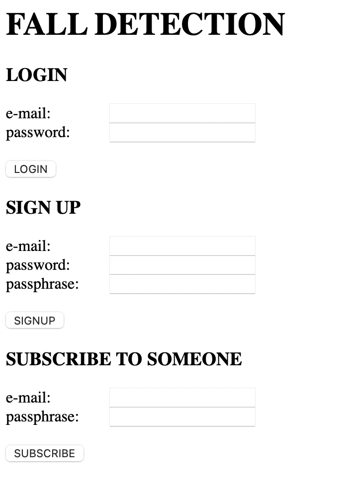

# FALL DETECTION
Progetto del corso di Pervasive Computing e Cloud di un sistema IoT per identificare la caduta di persone anziane in casa tramite mobile.

## FUNZIONALITA'
L'utente ha la possibiità di iscriversi al sistema, fare il login oppure sottoscriversi ad un altro utente. 
Ogni utente è iscritto tramite mail, password e passphrase. La pasphrase è la stringa che, se condivisa, può essere utilizzata dai parenti dell'utente per sottoscriversi al suo account e ricevere le mail di avviso caduta.
Gli account e le sottoscrizioni devono essere attivati tramite un link di conferma che viene mandato via mail.
Una volta creato ed attivato l'account, l'utente può fare partire l'accelerometro.
Il sensore monitora i movimenti dell'utente, tramite una logica basata su 3 stati (state 0, state 1, state 2), rileva le cadute e manda le mail di avviso caduta a tutte le persone sottoscritte all'account dell'utente.

## COME PREPARARE IL PROGETTO
- scaricare il codice di questo repo da github
- crea un nuovo virtual env: `python -m venv .venv`
- installa tutti i pacchetti python: `pip install -r requirements.txt`
- aggiungi alla home directory i 3 file certificati per collegarsi a Google Cloud SQL (*client-cert.pem*, *client-key.pem*, *server-ca.pem*)
- crea un file *email.txt* sempre nella home directory dove salvi la password / token del tuo account di posta
- nella funzione `send_email`, cambia l'indirizzo di posta elettronica
- nella funzione `init_db_connection`, cambia i campi *user*, *password*, *host* e *database*
- per dettagli sulla struttura del database guarda le slide
- per ulteriori informazioni su come impostare Cloud SQL https://towardsdatascience.com/sql-on-the-cloud-with-python-c08a30807661

## COME FARE DEPLOY
- entra nel virtual env: `source .venv/bin/activate`
- attiva l'istanza di Google Cloud SQL
- fai deploy dell'app su Google Cloud Run: `gcloud run deploy`
- vai al link: https://pervasive-fall-detection-iktn7mnx2a-uc.a.run.app